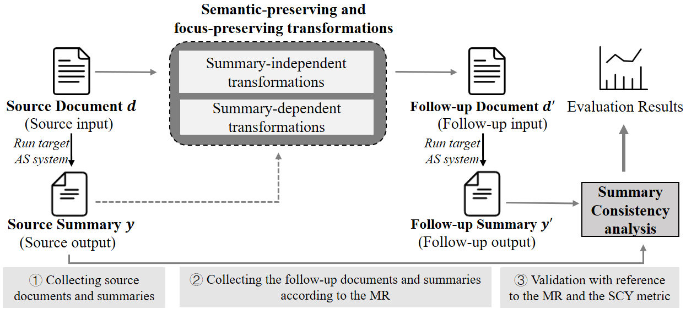

# Artifact for the Paper "MTAS: A Reference-Free Approach for Evaluating Abstractive Summarization Systems"

Abstractive Summarization (AS) in Natural Language Processing has made great strides in recent years. In order to convincingly tracking progress in this area and also to support practical usage of AS techniques, it is crucial to properly evaluate an AS system in order to reveal to what extent it can generate summaries capturing the core information of the original document. However, the existing reference-based evaluation approach is highly restricted by the availability of reference summaries as well as the capability of existing automatic evaluation metrics. In this paper, we address the above problems by introducing metamorphic testing techniques and new metrics for evaluating summaries quality. Our method, named MTAS, breaks the dependence on reference summaries and reveals various practical problems in AS systems.

#### MTAS Overview:
 

#### This artifact contains:
1. **Implementation and Usage Instruction of MTAS,**  the python scripts and the concrete instructions to generate the follow-up test cases and measure consistency with new metrics. (please refer to [1-tools.md](1-tools.md) for details)
